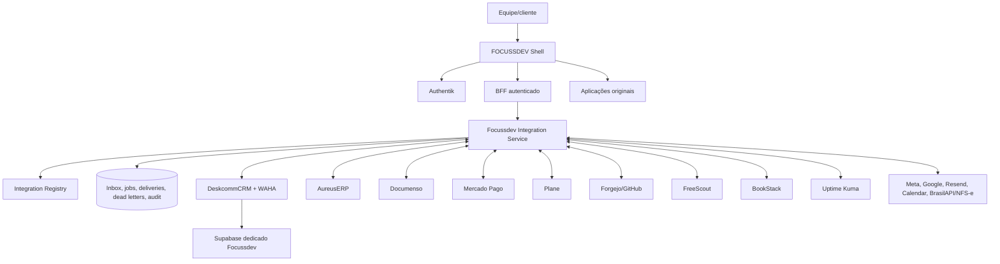

# FOCUSSDEV — Master Implementation Plan

Status: plano mestre executável, anterior à continuidade da implementação  
Data-base da auditoria: 20/09/2026  
Repositório de controle: `focussdevserv/focussdev-platform`  
Domínio principal confirmado: `focussdev.space`

Inventário funcional detalhado: [`FOCUSSDEV_FUNCTION_INVENTORY.md`](FOCUSSDEV_FUNCTION_INVENTORY.md).
Esse inventário é a matriz operacional para decidir se uma função pertence a um upstream, ao Core,
a uma integração externa, ou deve ser descartada.

## 1. Propósito e regra de leitura

O Focussdev será percebido como um único SaaS, mas continuará sendo uma arquitetura modular: um
shell próprio fornece entrada, identidade, navegação, pesquisa, notificações e integrações; cada
produto especializado conserva frontend, backend, banco, volumes, permissões e ciclo de atualização
originais.

Este documento separa quatro estados para não confundir intenção com realidade:

- **Instalado e comprovado**: existe evidência na VPS e/ou teste real.
- **Base instalada, validação pendente**: containers existem, mas a jornada ainda não foi aceita.
- **Snapshot analisado**: repositório local foi inspecionado, mas a versão final ainda não foi fixada.
- **Planejado**: não pode ser mostrado como disponível nem receber rota inventada.

Nenhuma etapa futura pode começar sem checkpoint, backup/rollback aplicável e prova de que os
recursos protegidos continuam intactos.

## 2. Objetivo final e critérios globais

### 2.1 Resultado desejado

`1 Focussdev → 1 entrada → 1 identidade → 1 menu mestre → aplicações originais completas`.

O produto final deve oferecer:

- `app.focussdev.space` como ponto principal;
- Authentik como identidade central onde houver suporte oficial a OIDC/OAuth2/SAML/proxy auth;
- sidebar e header persistentes do Focussdev;
- dashboard executivo e “Meu Dia” agregados por API;
- pesquisa, notificações e pendências transversais;
- central `Configurações → Integrações`;
- Focussdev Integration Service, sem n8n;
- Integration Registry com identidade única de clientes e vínculos externos;
- Cliente 360° e Projeto 360° como visões agregadas, sem duplicar as fontes;
- central de vencimentos, custos por cliente, ativos, backups, deploys, erros e auditoria;
- portal do cliente, com escopo e permissões ainda a detalhar;
- páginas originais dos aplicativos, sem clones ou dashboards reescritos;
- jornada ponta a ponta: Meta Lead Ads → CRM → WhatsApp → proposta/contrato Documenso → cobrança
  Aureus/Mercado Pago → pagamento → NFS-e → Plane → GitHub/Forgejo → deploy/Cloudflare → Uptime
  Kuma → FreeScout → recorrência.

Na jornada atual, “WhatsApp” significa WAHA porque é o adapter oficial já instalado com o
DeskcommCRM. A troca por Evolution só poderá ocorrer após decisão explícita, compatibilidade
comprovada e instalação dedicada do Focussdev; nunca reutilizando a Evolution protegida.

### 2.2 Critério de conclusão do ecossistema

O programa só estará concluído quando:

1. cada módulo ativo do menu apontar para rota real da versão instalada;
2. cada aplicação tiver HTTPS, backup restaurável, persistência, saúde e permissões validadas;
3. o login central estiver configurado onde oficialmente suportado, com contingência documentada;
4. a estratégia visual de cada app tiver sido testada com cookies, CSP, CORS, WebSocket e assets;
5. nenhum app protegido ou infraestrutura global tiver sido alterado indevidamente;
6. eventos críticos forem persistidos antes do efeito, idempotentes, auditáveis e recuperáveis;
7. o Integration Registry relacionar uma pessoa/empresa Focussdev aos IDs externos;
8. o dashboard executivo usar dados reais e declarar origem e atualização;
9. a jornada principal passar em teste ponta a ponta e os monitores estiverem verdes;
10. os checkpoints, inventário, runbooks, backups, restauração e rollback estiverem atualizados.

## 3. Arquitetura definida



### 3.1 Componentes do Focussdev Core

Pertencem ao Focussdev, não aos upstreams:

- Shell, sidebar, header, sessão de entrada, busca federada e notificações agregadas;
- dashboard executivo, Meu Dia, pendências e atalhos;
- BFF que transforma a sessão Authentik em chamadas internas autorizadas;
- Integration Service, catálogo de conectores, inbox, filas, retries, dead-letter e auditoria;
- Integration Registry (`fc_customer_*`, `fc_company_*`, vínculos e chaves externas);
- configurações gerais da empresa, equipe, domínios e integrações;
- políticas de acesso transversal e matriz de papéis;
- portal do cliente;
- Cliente 360° e Projeto 360°, montados por vínculos do Registry e consultas autorizadas;
- central de vencimentos e renovações, com responsável, prazo, alerta, confirmação e escalonamento;
- catálogo de ativos por cliente/projeto, custos alocados, backups, deploys e erros;
- trilha de auditoria administrativa transversal;
- ferramentas próprias de PDF, QR, imagem, relatório e conversão quando implementadas;
- observabilidade transversal e estado agregado, sem substituir o Uptime Kuma.

Não pertencem ao Core: configuração interna de projeto Plane, Git Forgejo, financeiro Aureus,
templates Documenso, caixas FreeScout, conteúdo BookStack ou administração interna de cada upstream.

### 3.1.1 Regra anti-duplicação

Antes de criar qualquer tela, tabela, endpoint ou função no Focussdev, responder:

> Isso já existe adequadamente em algum sistema instalado?

Se existir, o Focussdev apenas consulta, relaciona, resume, autoriza e oferece acesso à informação
original. Se não existir, a função poderá entrar no Core depois de declarar seu owner, schema, RBAC,
auditoria, backup e impacto.

É proibido criar no Focussdev:

- um novo CRM, pipeline, cadastro de leads ou caixa de conversas;
- um novo sistema de tarefas, bugs, ciclos ou projetos;
- um novo livro-caixa, contas a receber ou motor de pagamento;
- um novo sistema de contratos/assinaturas;
- um novo help desk, wiki, Git, banco, cofre ou monitoramento;
- telas que copiem integralmente dashboards já mantidos pelos upstreams.

Exemplos obrigatórios de agregação:

- `17 tarefas · 12 concluídas · 3 em andamento · 2 atrasadas` vem do Plane;
- `Contrato R$ 4.500 · Recebido R$ 2.000 · Pendente R$ 2.500` vem do Documenso/AureusERP/Mercado
  Pago conforme o estado oficial, nunca de uma tabela financeira paralela;
- status de código, deploy e release vêm do GitHub/Forgejo/CI;
- disponibilidade vem do Uptime Kuma;
- senha nunca é copiada para o cadastro de ativos: permanece no Vaultwarden.

### 3.1.2 Mapa do Cliente

O Mapa do Cliente é uma árvore de relacionamento do Registry, não um novo sistema operacional:

```text
Cliente
├── Projeto: Site Institucional
│   ├── Plane
│   ├── GitHub/Forgejo
│   ├── Supabase
│   ├── domínio e subdomínios
│   ├── Cloudflare
│   └── produção/homologação
├── Projeto: Sistema Interno
│   ├── Plane
│   ├── GitHub/Forgejo
│   ├── Supabase
│   └── produção/homologação
├── Documenso: proposta/contrato/assinatura
├── AureusERP/Mercado Pago: financeiro
├── FreeScout: suporte
└── BookStack: documentação
```

Cada nó mostra fonte, ID externo, última sincronização, estado e link para a interface original.
Ausência de sincronização não pode ser apresentada como “sem dados”. Deve aparecer como “não
conectado”, “pendente” ou “última leitura em …”.

### 3.1.3 Cadastro de Ativos

O ativo pertence ao Cliente 360° e/ou Projeto 360° e pode conter apenas metadados operacionais:

- tipo: site, sistema, app, API ou serviço;
- domínio, subdomínios, DNS, URL de produção e URL de homologação;
- repositório, organização, branch principal, commit/release atual;
- banco, schema lógico, storage, Supabase e Cloudflare relacionados;
- VPS/servidor, projeto EasyPanel, container e ambiente;
- API, webhook, WhatsApp, e-mail e documentação relacionada;
- monitor, backup, último restore drill, versão e estado;
- fornecedor, owner, observações técnicas, custo e vencimento/renovação.

Segredos, senhas, tokens, certificados privados e chaves não entram no ativo. O registro contém
somente uma referência segura ao Vaultwarden ou ao provedor responsável.

### 3.1.4 Capacidades que faltam entre os upstreams

Estas são funções próprias autorizadas do Focussdev porque não são substituídas adequadamente por um
único produto:

- Cliente 360°;
- Projeto 360°;
- ID Global do Cliente e ID Global do Projeto;
- relacionamentos entre registros externos;
- Mapa do Cliente;
- Central de Ativos;
- Timeline Unificada;
- Central de Links/Acessos;
- Central de Vencimentos;
- Busca Global;
- Meu Dia agregado;
- Visão Geral da Carteira;
- Onboarding de Projeto;
- checklists por tipo de projeto (site, SaaS, app, automação etc.);
- Encerramento/Entrega com checklist único;
- custos/rateios, estado de backups, deploys, erros e auditoria transversal.

Cada capacidade terá uma página de especificação que lista as fontes consultadas, campos exibidos,
permissões, freshness, comportamento quando a fonte estiver indisponível e link de retorno à origem.

#### Timeline Unificada

Eventos de CRM, contrato, pagamento, projeto, commit, deploy, monitor, ticket e documentação serão
normalizados em uma linha do tempo somente de leitura. Cada evento preserva `source_system`,
`external_id`, `event_type`, `occurred_at`, `received_at`, `actor`, `canonical_customer_id`,
`canonical_project_id`, link de origem e estado de sincronização. Ordenação usa o horário do evento;
recebimento atrasado é sinalizado. Um evento não pode ser editado pelo usuário para alterar a fonte.

#### Central de Links/Acessos

Links rápidos podem apontar para painel, produção, homologação, GitHub/Forgejo, Supabase, domínio,
Cloudflare, monitor, documentação e suporte. O catálogo guarda URL, ambiente, owner, health e última
verificação. Links de acesso não guardam credenciais nem criam bypass de RBAC.

#### Onboarding e encerramento

O onboarding orquestra criação de vínculos e checklists, mas a criação efetiva ocorre na aplicação
responsável, com confirmação e idempotência. Templates por tipo de projeto podem conter:

- cliente/contatos e escopo no DeskcommCRM;
- contrato/template no Documenso;
- cobrança no AureusERP;
- projeto, ciclos e work items no Plane;
- repositório e regras no GitHub/Forgejo;
- ambientes, domínio, DNS, Cloudflare, banco e storage no Cadastro de Ativos;
- monitor, backup, documentação e canal de suporte.

O encerramento/entrega verifica aceite, pagamentos, acessos, produção/homologação, domínio, backup,
monitoramento, documentação, handoff, suporte e renovação. Não apaga automaticamente nenhum dado de
upstream; apenas registra o estado final, responsáveis e pendências.

### 3.2 Princípios obrigatórios

- Não misturar os repositórios em um monólito.
- Não recriar nem simplificar dashboard upstream.
- Não escrever diretamente no banco interno de outro produto para integrar.
- Não inventar endpoint, webhook, rota, menu ou permissão.
- Preferir integração/embed oficial; depois reverse proxy + SSO; depois adaptação mínima e
  versionada; iframe somente após teste de segurança e funcionamento.
- Qualquer adaptação de modo integrado deve ser pequena, opt-in, reaplicável e testada a cada bump.
- Um item incompleto aparece como “Em implantação”, sem link enganoso.
- Cada stack usa banco, volume, credenciais, backup e rede próprios quando aplicável.
- Segredos ficam em cofre/env protegidos, nunca no Git, frontend, URL, logs ou checkpoint.

## 4. Auditoria atual da VPS

### 4.1 Host correto

| Item | Estado observado |
|---|---|
| Host/IP | `srv1257466` / `72.62.138.208` |
| Sistema | Ubuntu 24.04, kernel `6.8.0-136-generic` |
| CPU/RAM | 2 vCPU; 8.326 GB RAM |
| Memória no instante da coleta | 5.800 GB usados; 2.526 GB disponíveis |
| Swap | 2.147 GB; praticamente 100% ocupada |
| Disco raiz | 102.9 GB; 35.9 GB usados; 67.0 GB disponíveis |
| Docker/Compose | 29.7.1 / 5.3.1 |
| Swarm | ativo |
| Proxy/painel | Traefik 3.6.7 + EasyPanel |
| Portas públicas | 22, 80, 443, 3000 e temporariamente 3005 |

**Gate de capacidade:** a VPS não tem folga segura para instalar simultaneamente Plane, Documenso,
AureusERP, Forgejo, FreeScout e BookStack. Antes da próxima stack pesada deve ser decidido entre
upgrade (mínimo operacional a medir: 4 vCPU/16 GiB, preferível maior conforme ensaio), segunda VPS
exclusiva ou distribuição por serviços gerenciados. A decisão deve ser baseada em teste de carga e
orçamento, não apenas nesse valor indicativo.

### 4.2 Infraestrutura instalada e estado

| Stack | Versão/imagem observada | Estado |
|---|---|---|
| Authentik | `2026.8.3`, Postgres 16 | instalado, saudável, HTTPS, backup |
| Uptime Kuma | `2.5.5` | instalado, saudável, embed PoC aprovado |
| Vaultwarden | `1.37.3` | instalado, saudável, OIDC e backup aprovados |
| Supabase Focussdev | Postgres `15.8.1.085`, GoTrue `2.186.0`, Studio `2026.04.27...` e componentes oficiais | base instalada; functions parada por não haver funções |
| DeskcommCRM | imagem oficial `stable`, metadado anteriormente como app `1.41.0`; source VPS em `6eceb0e` | containers saudáveis; publicação/jornada pendentes |
| WAHA | `latest-2026.7.2` | ativo dentro da stack CRM; sessão real pendente |
| Integration Service | bootstrap `main`, Node 22 + Postgres `17.6` | API/worker/fila instalados; conectores ainda `not_implemented` |
| Hub | Cloudflare Pages | publicado em `app.focussdev.space` |

O uso observado confirma que o Supabase Focussdev e o CRM consomem parcela relevante da memória.
Tags mutáveis como `stable`, `main` e `latest-*` devem ser substituídas por release/digest fixo no
checkpoint de estabilização, sem recompilar na VPS.

### 4.3 Redes, bancos, volumes e storage

Recursos Focussdev observados:

- redes privadas `focuss-authentik_default`, `focuss-integration-service_internal`,
  `focuss-uptime-kuma_default`, `focuss-vaultwarden_default`, `focussdev_supabase_default` e
  `focussdevcrm_internal`;
- rede compartilhada de entrada `easypanel`, usada somente para rotas necessárias;
- volumes `focuss-authentik-database`, `focuss-integration-service-postgres-data`,
  `focuss-uptime-kuma-data`, `focuss-vaultwarden-data`, `focussdev_supabase_db-config`,
  `focussdev_supabase_deno-cache`, `focussdevcrm_waha-data` e `focussdevcrm_waha-media`;
- PostgreSQL exclusivos para Authentik, Supabase Focussdev e Integration Service;
- SQLite dentro do volume do Vaultwarden;
- storage Supabase e mídias/sessões WAHA exclusivos da stack Focussdev.

Há dois volumes antigos `deskcommcrm_waha-*` e dois volumes anônimos. Eles **não podem ser
apagados** até inspeção de consumidores, conteúdo, labels, data e comparação com os volumes
`focussdevcrm_*`. Nenhum prune global é permitido.

Backups comprovados existem para Authentik, Uptime Kuma e Vaultwarden. Ainda faltam política,
retenção e ensaio de restauração para Supabase/CRM/WAHA e Integration Service.

### 4.4 Domínios, proxy e TLS

| Domínio | DNS/TLS em 20/09/2026 | HTTP observado | Estado |
|---|---|---|---|
| `app.focussdev.space` | Cloudflare, certificado válido | 200 | disponível |
| `auth.focussdev.space` | VPS, Let's Encrypt válido | 302 para login | disponível |
| `status.focussdev.space` | VPS, Let's Encrypt válido | 302 para dashboard | disponível |
| `cofre.focussdev.space` | VPS, Let's Encrypt válido | 200 | disponível |
| `crm.focussdev.space` | VPS, Let's Encrypt válido | 404 Traefik | rota incorreta/ausente |
| `supabase.focussdev.space` | VPS, Let's Encrypt válido | 401 Kong | alcançável; API protegida |
| `supabase-admin.focussdev.space` | registro A ausente | indisponível | não publicar ainda |

O 404 do CRM é consistente com labels usando entrypoints diferentes dos nomes reais do Traefik.
A correção futura deve recriar apenas o container `app` da stack CRM, após validar o compose, criar
backup e comparar o hash dos recursos protegidos. A porta pública temporária 3005 deve desaparecer
depois do HTTPS aceito.

### 4.5 Recursos protegidos e host fora do escopo

Não alterar:

- `credmaisapp` e seus 13 containers Supabase;
- projeto `evolutions` (Evolution API, Postgres, Redis e volume de instâncias);
- EasyPanel, Traefik, Docker, Swarm, firewall, senha root e sistema operacional globais;
- redes, portas, certificados ou arquivos compartilhados além da adição estritamente necessária;
- host `2.25.225.206` (`nexsiles` e `elolab`), onde não há Focussdev.

O Focussdev antigo e o projeto `botscassino` já foram removidos com as verificações e backups
registrados em `checkpoints/00-inventario-vps.md`; não há nova limpeza autorizada implícita.

## 5. Inventário dos repositórios e serviços escolhidos

### 5.1 Repositórios próprios e snapshots upstream

| Componente | Repositório/snapshot auditado | Função e arquitetura | Banco/storage | SSO/API/webhooks | Integração visual e limites |
|---|---|---|---|---|---|
| Focussdev Platform | `focussdevserv/focussdev-platform` | Hub estático, manifests e Integration Service TS/Fastify | Postgres próprio do serviço | BFF ainda pendente | é o Core; não recebe código copiado dos upstreams |
| DeskcommCRM | upstream `melgarafael/DeskcommCRM`; fork local `focussdevserv/fullfocus2` em `cd3cbb2`; deploy source `6eceb0e` | Next.js 16, React 19, Supabase, workers, WAHA | Supabase e volumes WAHA exclusivos | REST/MCP/webhooks existem por superfície própria; SSO Authentik não comprovado | usar frontend original; modo embedded só após CSP/cookie teste; worktree local está suja e é somente leitura nesta iniciativa |
| AureusERP | `aureuserp/aureuserp`, snapshot `d7d471894`, descrito como `v1.6.0-50` | Laravel/Vue modular, plugins Webkul | banco relacional + arquivos; definir imagem/volumes | rotas API por plugins observadas; SSO/webhooks ainda não comprovados para a versão final | rota/menu só após pin de release e teste; estimar consumo em staging |
| Documenso | `documenso/documenso`, snapshot `e658cc5`, pacote `2.18.0` | Remix/React, API e jobs | PostgreSQL + S3 compatível | API v2, webhooks e embeds oficiais; SSO/licença precisam ser confirmados | embed oficial cobre fluxos específicos, não autoriza presumir dashboard inteiro embedded |
| Plane | `makeplane/plane`, snapshot `01064a7`, pacote `1.4.2` preview | React Router + Django/API + workers e storage | PostgreSQL, Redis/Valkey, object storage | REST/webhooks/OAuth Apps; OIDC oficial é plano Pro/Business na documentação atual | app pesado; instalar só após gate de capacidade e licença; rotas dependem de workspace/project slug |
| Forgejo | `forgejo/forgejo`, snapshot `e3a8562` | Go + frontend, Git e Actions opcionais | banco relacional + repositórios/attachments | REST/Swagger, webhooks e OIDC auth source suportados | subdomínio próprio preferível; subpath pode trazer risco; runner é etapa separada |
| FreeScout | `freescout-help-desk/freescout`, tag `1.8.241` | Laravel help desk + cron/queue/IMAP/SMTP | MySQL/MariaDB + attachments | API/Webhooks e SAML são módulos oficiais separados, potencialmente pagos | custo/licença dos módulos é decisão do proprietário; sem eles não inventar conector/SSO |
| BookStack | `BookStackApp/BookStack`, snapshot `cf13354` | Laravel, conteúdo hierárquico | MySQL/MariaDB + uploads | OIDC nativo, REST API e webhooks oficiais | bom candidato a Authentik; validar CSP antes de embed; conteúdo sem segredos |
| Uptime Kuma | `louislam/uptime-kuma`; produção fixada em `2.5.5` | Node/Vue + Socket.IO | volume próprio/SQLite | sem OIDC/SAML nativo comprovado; API interna não deve ser tratada como contrato | iframe restrito ao Hub foi comprovado; navegação original permanece |
| Vaultwarden | `dani-garcia/vaultwarden`; produção `1.37.3` | Rust + Web Vault original | SQLite e anexos em volume próprio | OIDC oficial configurado; API compatível Bitwarden | não expor segredos ao Integration Service; por segurança, não forçar embed |
| Authentik | `goauthentik/authentik`; produção `2026.8.3` | Python/Go/worker/Postgres | Postgres + media/templates | IdP OIDC/OAuth2/SAML, proxy provider e API v3 | console administrativo restrito; não deve ser iframe genérico |
| Supabase | stack oficial self-hosted auditada | Postgres, Auth, REST, Realtime, Storage, Studio, Kong etc. | volumes/binds exclusivos | APIs oficiais por componente | Studio apenas Admin/Dev; domínio administrativo separado e não publicado ainda |
| WAHA | imagem oficial `devlikeapro/waha:latest-2026.7.2` | canal WhatsApp do CRM | sessão e mídia em volumes próprios | webhooks/API da versão devem ser confirmados antes do conector | vendedor usa Inbox do CRM; console WAHA é administração |

### 5.1.1 Dossiê técnico mínimo por repositório

Estes dossiês definem o que precisa ser comprovado antes de instalar ou ativar cada stack. Onde o
snapshot local não prova um recurso da futura imagem, o estado é deliberadamente “não comprovado”.

#### Focussdev Platform

- **Arquitetura/requisitos:** Hub HTML/CSS/JS hoje hospedado no Pages; Integration Service Node 22,
  Fastify, TypeScript, Zod, `pg`, worker e Postgres 17.6. O estado final exige runtime para BFF e
  sessão, ainda não escolhido.
- **Autenticação/permissões:** o Hub estático ainda não autentica; o BFF deverá validar Authentik,
  aplicar RBAC e nunca entregar token administrativo ao browser.
- **API/webhooks:** base do Integration Service já tem health, catálogo administrativo, inbox,
  jobs, deliveries, dead-letter e audit; nenhum conector externo está liberado.
- **Rotas/menu:** `/` e a view local de Integrações existem; demais páginas Core precisam de
  registry versionado antes de ativação.
- **Visual/update:** é o único componente autorizado a criar a moldura visual. Deploy do Hub é por
  CI; imagem do serviço é publicada por CI, não construída na VPS.
- **Recursos/conflitos:** consumo atual do serviço é baixo, mas o BFF/dashboards aumentarão carga;
  não pode concentrar bancos internos dos upstreams.

#### DeskcommCRM + WAHA

- **Arquitetura/requisitos:** Next.js 16/React 19/TypeScript 6, Supabase Auth/Postgres/Realtime/
  Storage, Redis HTTP, worker, scheduler e WAHA. Node 22 e imagens oficiais publicadas são o
  contrato do produto self-host.
- **Banco/volumes:** Supabase `focussdev_supabase` exclusivo; WAHA usa volumes próprios de sessão e
  mídia. Migrations do CRM pertencem ao upstream e não serão reescritas pelo Focussdev.
- **Autenticação/permissões:** Supabase Auth e RBAC multi-tenant nativos; SSO Authentik não está
  comprovado. Rotas administrativas reais devem respeitar os papéis do catálogo.
- **API/webhooks:** REST versionado, webhooks, MCP e superfícies internas existem no source; cada
  rota que o conector precisar será verificada na build instalada, incluindo método de auth.
- **Menu/páginas:** catálogo real listado na seção 7.2; menus incluem Atendimento, CRM, IA, Canais,
  Análise e Organização. Não criar páginas genéricas ausentes.
- **Visual/update:** domínio próprio e frontend completo. Ocultar shell interno só se existir modo
  opt-in seguro; não editar o worktree upstream sujo nem criar fork visual divergente.
- **Recursos/conflitos:** app limitado a 768 MiB e worker a 512 MiB; WAHA a 1,25 GiB, além do
  Supabase completo. É a principal pressão atual de RAM. A Evolution protegida não participa.

#### AureusERP

- **Arquitetura/requisitos:** Laravel/Vue com plugins Webkul; snapshot pós-`v1.6.0`. Antes do deploy
  serão confirmados PHP/extensões, Composer, Node somente para build, banco e imagem oficial.
- **Banco/volumes:** banco relacional e storage de documentos/logos; engine, migration e backup
  serão definidos pela release/compose oficial, nunca presumidos pelo snapshot.
- **Autenticação/SSO:** autenticação própria observável no app; OIDC/SAML/proxy auth não comprovado.
- **API/webhooks:** `routes/api.php` e APIs de plugins Accounts, Inventories, Projects, Products,
  Partners, Support, Sales e Purchases foram encontradas; isso não prova que todas estão habilitadas
  nem que existe webhook para a jornada financeira.
- **Menu/páginas/permissões:** catálogo financeiro será extraído com `php artisan route:list` e do
  menu da release. Plugins opcionais não podem virar item de menu antes de instalados/licenciados.
- **Visual/update:** testar base URL, cookies, CSRF e assets no proxy. Não ocultar menu por CSS
  global sem contrato de modo integrado.
- **Recursos/conflitos:** estimativa somente após staging; espera-se app PHP + web server + worker +
  banco. Conflita com a capacidade atual e com duplicação indevida de CRM/projetos se plugins forem
  habilitados sem definição de source of truth.

#### Documenso

- **Arquitetura/requisitos:** monorepo Node >=24 na versão analisada, Remix/React, jobs, Prisma,
  PostgreSQL, SMTP e storage S3 compatível. Imagem/release final será fixada.
- **Banco/volumes:** Postgres exclusivo, chaves/certificados de assinatura e object storage com
  backup coordenado; restore deve preservar documentos, audit trail e objetos.
- **Autenticação/SSO:** login próprio existe; a release contém telas de SSO de organização, mas
  disponibilidade/licença e compatibilidade Authentik ainda precisam ser comprovadas.
- **API/webhooks:** `/api/v2` e OpenAPI são oficiais; API v1 existe mas Documents/Templates estão em
  transição para Envelopes. Webhooks de equipe e secret opcional existem; o secret será obrigatório
  no Focussdev.
- **Menu/páginas:** snapshot comprova `/dashboard`, `/inbox`, documentos/templates e settings
  parametrizados por `teamUrl`/`orgUrl`, além de rotas embed de authoring/signing. A URL concreta só
  nasce após os slugs reais.
- **Visual/update:** usar embed oficial apenas nos fluxos suportados. O dashboard completo não será
  presumido embeddable.
- **Recursos/conflitos:** app/jobs/Postgres/object storage aumentam RAM e disco; SMTP e validade de
  assinatura são dependências externas. Não duplicar propostas no CRM além de vínculo/status.

#### Plane

- **Arquitetura/requisitos:** monorepo React Router + Django/API + workers; Postgres, Redis/Valkey e
  object storage. O compose final da release define demais serviços.
- **Autenticação/SSO:** login próprio; OIDC é oficialmente descrito para planos Pro/Business. Sem
  licença, não declarar login único.
- **API/webhooks:** REST com amplo catálogo, webhooks e OAuth Apps. Endpoints de `issues` estão
  descontinuados em favor de `work-items`; conectores novos usarão o contrato atual.
- **Menu/páginas:** URLs são parametrizadas por workspace/project. Catálogo só será persistido após
  instalação, criação do workspace e inspeção da build.
- **Visual/update:** testar realtime, uploads, redirects e deep links; não reimplementar boards.
- **Recursos/conflitos:** stack reconhecidamente pesada e proibida na capacidade atual sem decisão.
  Plane será source of truth de projeto; plugins de projeto do ERP não assumirão esse papel.

#### Forgejo

- **Arquitetura/requisitos:** binário Go, frontend, banco suportado, filesystem/object storage para
  repos/LFS/attachments e SSH opcional. Runner Actions é componente separado.
- **Autenticação/SSO:** auth source OAuth2/OpenID Connect com auto-discovery e group mappings
  documentados; configurar Authentik por CLI/config da release.
- **API/webhooks:** REST/Swagger e webhooks de repositório/organização; payload/eventos serão fixados
  pela release instalada.
- **Menu/páginas:** repositórios, organizações, issues, PRs, commits, branches, tags, releases e
  Actions existem no produto, mas os paths concretos incluem owner/repo e serão gerados por contexto.
- **Visual/update:** subdomínio é preferível; documentação Forgejo alerta que subpath pode afetar
  segurança. Não injetar shell em conteúdo Git fornecido por usuário.
- **Recursos/conflitos:** servidor sem runner é moderado; CI pode ser ilimitado e hostil. Nenhum
  runner privilegiado compartilhará o daemon Docker principal.

#### FreeScout

- **Arquitetura/requisitos:** Laravel, MySQL/MariaDB, IMAP/SMTP, cron, queue worker e storage de
  anexos; release auditada `1.8.241`.
- **Autenticação/SSO:** login próprio no core; SAML 2.0 oficial vem de módulo separado e mapeia
  usuários, com limitações para equipes/mailboxes.
- **API/webhooks:** módulo oficial separado fornece API keys e webhooks HMAC `X-FreeScout-Signature`,
  com eventos de conversa/cliente e retries upstream. Sem o módulo, o conector não existe.
- **Menu/páginas:** caixas, conversas, clientes, histórico e configurações serão extraídos por
  `route:list`, incluindo rotas adicionadas pelos módulos aprovados.
- **Visual/update:** testar sessão, CSRF, iframe headers e módulos; customização/rebranding também é
  módulo, portanto não será presumida.
- **Recursos/conflitos:** app + banco + queue + tráfego IMAP. Licenças dos módulos, e-mail e anexos
  são dependências. FreeScout é suporte; não duplicar pipeline CRM.

#### BookStack

- **Arquitetura/requisitos:** Laravel, MySQL/MariaDB, cache/queue opcionais e uploads; snapshot
  `cf13354`, release final ainda a fixar.
- **Autenticação/SSO:** OIDC nativo com discovery, RS256, PKCE, auto-registro configurável e sync de
  grupos para roles; Authentik é compatível mediante teste.
- **API/webhooks:** REST API documentada na instância e outgoing webhooks oficiais. URLs de webhook
  exigem allowlist/controle SSRF e fila assíncrona.
- **Menu/páginas:** shelves/books/chapters/pages/search/recentes; paths finais serão extraídos de
  `route:list` da release. A documentação API costuma estar em `/api/docs`, a confirmar na build.
- **Visual/update:** conteúdo pode conter HTML/iframes; CSP e permissões precisam ser mantidos. Não
  guardar credenciais em páginas.
- **Recursos/conflitos:** relativamente moderado, mas banco/uploads exigem backup conjunto. Não
  transformar BookStack em source of truth de arquivos de projeto.

#### Uptime Kuma

- **Arquitetura/requisitos:** Node/Vue, Socket.IO e volume SQLite. Produção `2.5.5` está fixada.
- **Autenticação/SSO:** login próprio; OIDC/SAML nativo não comprovado nessa versão.
- **API/webhooks:** socket/rotas internas não são contrato de integração. Usar somente mecanismos
  oficialmente confirmados para notificações/status; scraping é proibido.
- **Menu/páginas:** `/dashboard` comprovada. Rotas internas adicionais só entram após extração do
  router exatamente da tag 2.5.5.
- **Visual/update:** iframe funciona com CSP `frame-ancestors` limitado ao Hub, WebSocket aprovado e
  navegação original visível. Revalidar a cada upgrade.
- **Recursos/conflitos:** cerca de 155 MiB observados; não usar como banco central de incidentes.

#### Vaultwarden

- **Arquitetura/requisitos:** servidor Rust e Web Vault original; produção `1.37.3` com SQLite em
  volume exclusivo.
- **Autenticação/SSO:** OIDC Authentik completo e testado; criação automática desabilitada e login
  nativo preservado como contingência.
- **API/webhooks:** API compatível com clientes Bitwarden; o Integration Service não terá permissão
  para ler o cofre. Credenciais de conectores serão injetadas, não consultadas em massa.
- **Menu/páginas:** Web Vault raiz é a rota suportada; subrotas SPA não serão hardcoded no menu mestre.
- **Visual/update:** por sensibilidade, manter interface independente; não relaxar CSP para embed.
- **Recursos/conflitos:** cerca de 9 MiB observados; risco principal é segurança, não capacidade.

#### Authentik

- **Arquitetura/requisitos:** server/worker `2026.8.3`, Postgres 16, media/templates e blueprints.
- **Autenticação/permissões:** source of truth de usuários, grupos, aplicações, providers, policies e
  flows globais. Administração somente a grupo restrito e com MFA.
- **API/webhooks:** API v3 e health endpoints comprovados; tokens somente por finalidade mínima.
- **Menu/páginas:** console raiz redireciona ao flow; URLs administrativas internas não serão
  hardcoded porque o frontend pode mudar entre releases.
- **Visual/update:** aplicação independente; pode fornecer proxy provider para apps compatíveis, mas
  isso não substitui autorização interna.
- **Recursos/conflitos:** server ~456 MiB, worker ~272 MiB, Postgres ~76 MiB observados. Mudança de
  flow pode bloquear todo ecossistema, logo exige conta break-glass e rollback.

#### Supabase Focussdev

- **Arquitetura/requisitos:** Postgres, Auth, REST, Realtime, Storage, Studio, Kong, Supavisor,
  Analytics, Vector, Meta, imgproxy e Edge Runtime. Functions parada é esperado enquanto vazia.
- **Autenticação/permissões:** Auth do Deskcomm é distinto de Authentik. Studio é superfície admin;
  chaves anon/service-role têm escopos e exposição completamente diferentes.
- **API/webhooks:** APIs oficiais por componente; Database Webhooks só se a versão/configuração
  comprovar. Integração externa não ganha service role ampla.
- **Menu/páginas:** Studio contém Table/SQL/Database/Auth/Storage/API/Logs, mas o domínio admin ainda
  não está publicado. Rotas SPA só serão catalogadas após acesso restrito.
- **Visual/update:** Studio não será iframe público. API e Studio devem ter políticas/domínios
  separados.
- **Recursos/conflitos:** esta é a maior stack da VPS; vários containers consomem >1,5 GiB no total
  em repouso. Não reutilizar `credmaisapp_supabase` e não duplicar uma terceira stack sem capacidade.

#### WAHA

- **Arquitetura/requisitos:** engine NOWEB `2026.7.2`, sessão e mídia persistentes; usado pelo
  Deskcomm como adapter de canal.
- **Autenticação/API/webhooks:** contrato exato será lido da versão instalada antes do conector; API
  administrativa não será exposta a vendedores.
- **Menu/páginas:** QR/status/admin somente para gestores; conversa diária permanece no Inbox CRM.
- **Visual/update:** console independente; não duplicar Inbox no Core.
- **Recursos/conflitos:** ~264 MiB observados com limite 1,25 GiB; sessão real pode elevar consumo.
  Não apontar para a Evolution de outro projeto.

### 5.2 Serviços externos e APIs

| Serviço | Responsabilidade | Pré-condição/segurança |
|---|---|---|
| Mercado Pago | PIX, links, cartão, status, estorno | produtos habilitados; OAuth/credenciais no cofre; assinatura/consulta defensiva de webhook; idempotência financeira |
| GitHub | repositórios externos, issues, PRs, Actions, releases | GitHub App com permissões mínimas; evitar PAT amplo |
| Meta | Ads, campanhas e Lead Ads | app Meta aprovado, Business/contas e revisão de permissões |
| Google Ads | campanhas e conversões | projeto Google, OAuth e developer token aprovados |
| Google Calendar | agenda, reuniões e eventos | OAuth por usuário ou service account conforme domínio; consentimento e escopos mínimos |
| Resend | e-mails transacionais | domínio validado, SPF/DKIM/DMARC, templates e política de bounce |
| BrasilAPI/ReceitaWS | consulta CEP/CNPJ | cache, limites, LGPD e fallback; não assumir SLA gratuito |
| NFS-e | emissão de nota fiscal | município/provedor, certificado e homologação ainda não definidos |
| Hostinger API | DNS e gestão de VPS | tokens enviados no chat devem ser rotacionados; não usar como segredo duradouro |
| Cloudflare | Pages/DNS/possível Access | token de escopo mínimo; Access não ativado porque a conta exigiu meio de pagamento |

### 5.3 Mapa de domínios desejado

| Componente | Domínio proposto | Estado |
|---|---|---|
| entrada/shell | `app.focussdev.space` | ativo |
| identidade | `auth.focussdev.space` | ativo |
| CRM | `crm.focussdev.space` | DNS/TLS ativo; roteamento 404 |
| financeiro | `financeiro.focussdev.space` | planejado |
| documentos | `documentos.focussdev.space` | planejado |
| projetos | `projetos.focussdev.space` | planejado |
| Forgejo | `git.focussdev.space` | planejado |
| suporte | `suporte.focussdev.space` | planejado |
| documentação | `docs.focussdev.space` | planejado |
| monitoramento | `status.focussdev.space` | ativo |
| cofre | `cofre.focussdev.space` | ativo |
| Supabase API | `supabase.focussdev.space` | alcançável via Kong, 401 esperado na raiz |
| Supabase Studio | `supabase-admin.focussdev.space` | DNS ausente; acesso restrito pendente |
| WhatsApp admin dedicado | `whatsapp.focussdev.space` | planejado somente se necessário |

Cada novo registro deve ser criado somente na etapa da stack, com proxy, certificado, monitor e
rollback. Um domínio não torna a aplicação “Disponível” antes da jornada real passar.

## 6. Source of Truth e propriedade dos dados

| Informação | Source of Truth | O que o Core pode guardar |
|---|---|---|
| identidade, grupos e acesso global | Authentik | `authentik_user_id`, papéis derivados e auditoria |
| empresa e identidade transversal do cliente | Focussdev Registry | ID canônico, vínculos externos, consentimentos e estado de sincronização |
| vencimentos e obrigações de renovação | Focussdev Core; data contratual/financeira referenciada na origem | tipo, vencimento, responsável, recorrência, vínculo, estado e evidência de conclusão |
| custo e rentabilidade por cliente | AureusERP para lançamentos; Focussdev Registry para rateio/vínculo | regra de alocação, competência e referência ao lançamento, sem livro-caixa paralelo |
| ativos do cliente/projeto | Focussdev Registry | identidade, tipo, ambiente, URL/referência, owner e vínculos; segredo fica no Vaultwarden |
| estado de backup e restore drill | sistema de backup/orquestração de cada stack | execução, tamanho, destino lógico, checksum, RPO/RTO e último restore testado |
| deploys e versões | Forgejo/GitHub/CI/CD/Cloudflare | commit, release, ambiente, resultado, horário e correlação |
| erros de aplicações próprias | ferramenta de erro/observabilidade a decidir | fingerprint, serviço, release, severidade, estado e responsável; payload saneado |
| auditoria administrativa transversal | Focussdev Integration Service/Core | ator, ação, alvo, request/correlation ID, antes/depois saneado e timestamp |
| leads, contatos, conversas e pipeline | DeskcommCRM | ID externo, resumo mínimo e cursor de sync |
| sessão/mensageria WhatsApp do CRM | WAHA/DeskcommCRM | evento, correlação e status; não duplicar mídia sem necessidade |
| finanças, contas, categorias e caixa | AureusERP | ID de lançamento/cobrança e estado para orquestração |
| pagamento e liquidação | Mercado Pago para evento do meio de pagamento; Aureus para contabilidade | IDs, idempotency key, valor/moeda/status e evidência do webhook |
| documentos, assinantes e assinatura | Documenso | envelope/document ID, status, hash e datas necessárias |
| projetos, work items, ciclos e módulos | Plane | IDs e relações com cliente/contrato/repo |
| Git, issues técnicas, PRs e releases | Forgejo/GitHub | IDs/URLs e relações; código permanece no Git |
| tickets e histórico de suporte | FreeScout | IDs, prioridade/status e relação com cliente/projeto |
| documentação | BookStack | IDs/URLs, tags e relação; nunca senhas |
| disponibilidade e incidentes | Uptime Kuma | monitor/status corrente e agregados necessários |
| credenciais | Vaultwarden | somente referência lógica; nunca conteúdo do segredo |
| banco/auth/storage dos sistemas próprios | Supabase Focussdev | apenas metadados operacionais no Registry |

O Registry deve usar chaves estáveis, por exemplo `fc_customer_00032`, e uma tabela de vínculos
(`system`, `entity_type`, `external_id`, `canonical_id`, `tenant`, timestamps e estado). Mudança de
vínculo é auditada; colisões vão para revisão humana; remoção segue retenção/LGPD.

## 7. Menu mestre desejado e rotas comprovadas

Regra: a coluna “rota” só contém valor quando encontrado na versão auditada/instalada. `GATE` não é
uma rota: significa que o item ficará desativado até o checkpoint da versão final.

### 7.1 Focussdev Core

| Área/item | Origem | Rota | Permissão | Integração |
|---|---|---|---|---|
| Início / Meu Dia | Focussdev | `/` no Hub atual; rotas internas serão versionadas no Shell dinâmico | usuário | BFF e agregadores |
| Pendências, Atalhos, Notificações | Focussdev | GATE | usuário | eventos normalizados |
| Pesquisa global | Focussdev | GATE | por RBAC | índices/APIs autorizadas |
| Configurações / Integrações | Focussdev | view já existente no Hub; API real via BFF é GATE | admin | Integration Service |
| Empresa, equipe, segurança, domínios | Focussdev/Auth | GATE | owner/admin | Authentik + Registry |
| Portal do cliente | Focussdev | GATE | cliente | BFF, escopo por cliente |
| Cliente 360° | Focussdev | GATE | por carteira/RBAC | Registry + APIs de todas as fontes vinculadas |
| Projeto 360° | Focussdev | GATE | equipe/cliente autorizado | Registry + Plane/Git/deploy/infra/financeiro |
| Vencimentos e renovações | Focussdev | GATE | gestor/financeiro/owner | Registry + ERP + integrações de domínio/infra |
| Custos e rentabilidade | Focussdev | GATE | financeiro/owner | AureusERP + regras de alocação |
| Ativos | Focussdev | GATE | por cliente/projeto | Registry; segredo apenas no Vaultwarden |
| Backups e restaurações | Focussdev | GATE | admin/devops | agentes/runbooks/monitores de cada stack |
| Deploys e versões | Focussdev | GATE | dev/gestor | Forgejo/GitHub/CI/Cloudflare |
| Central de erros | Focussdev | GATE | dev/suporte/gestor | provedor de erros a decidir + correlação de release |
| Auditoria | Focussdev | GATE | auditor/owner | audit log transversal imutável por política |

### 7.2 DeskcommCRM — rotas reais encontradas no catálogo da versão auditada

| Grupo | Item original | Rota real | Papel mínimo observado/planejado |
|---|---|---|---|
| Atendimento | Inbox | `/app/inbox` | usuário autorizado |
| Atendimento | Radar | `/app/radar` | usuário autorizado |
| Atendimento | Agenda | `/app/agenda` | usuário autorizado |
| Atendimento | Respostas rápidas | `/app/templates` | usuário autorizado |
| CRM | Funis | `/app/kanban` | usuário autorizado |
| CRM | Contatos | `/app/contacts` | usuário autorizado |
| CRM | Tarefas | `/app/tasks` | usuário autorizado |
| CRM | Chamadas | `/app/calls` | manager |
| CRM | Produtos | `/app/products` | usuário autorizado |
| CRM | Comandas | `/app/comandas` | usuário autorizado/extensão |
| CRM | Etapas do funil | `/app/settings/tenant/pipelines` | manager |
| Comercial | Prospecção | `/app/prospecting` | admin |
| IA | Agentes | `/app/ai/agents` | papel a validar |
| IA | Follow-ups | `/app/ai/followups` | papel a validar |
| IA | Roteadores | `/app/ai/routers` | papel a validar |
| IA | Credenciais/Providers/Base/Memória/Skills | `/app/ai/credentials`, `/app/ai/providers`, `/app/ai/knowledge/sources`, `/app/ai/memory`, `/app/ai/skills` | manager/admin |
| IA | Casos, Inbox IA, Propostas, Execuções, Uso | `/app/ai/cases`, `/app/ai/inbox`, `/app/ai/proposals`, `/app/ai/runs`, `/app/ai/usage` | papel a validar |
| Canais | Conexões | `/app/connections` | manager/admin |
| Canais | Nuvemshop | `/app/integrations/nuvemshop` | manager/admin |
| Canais | Webhooks | `/app/webhooks` | manager/admin |
| Análise | Faturamento/Métricas/Meta Ads/Atividades | `/app/faturamento`, `/app/metrics`, `/app/ads/meta`, `/app/activities` | papel a validar |
| Organização | Perfil/Segurança/Notificações/Equipe | `/app/settings/profile`, `/app/settings/security`, `/app/settings/notifications`, `/app/team` | conforme tela |
| Organização | Atendimento/Tags/Tenant/Conversões/Meta/Marca/Billing | `/app/settings/atendimento`, `/app/settings/tags`, `/app/settings/tenant`, `/app/settings/conversoes`, `/app/settings/meta-ads`, `/app/settings/marca`, `/app/settings/billing` | manager/admin |
| Organização | LGPD/API tokens/VoIP/Extensões/Integração de dados | `/app/lgpd/requests`, `/app/settings/api-tokens`, `/app/settings/voip-trunk`, `/app/extensions`, `/app/integracao-dados` | admin |

Os nomes genéricos “Leads”, “Clientes”, “Empresas” e “Oportunidades” não serão usados como links
se essa versão não tiver exatamente essas páginas. O menu Focussdev traduz apenas agrupamentos sem
fingir que há rota inexistente.

### 7.3 Demais aplicativos

| Área | Itens desejados | Rota real já comprovada | Regra de ativação |
|---|---|---|---|
| Monitoramento | dashboard original | `https://status.focussdev.space/dashboard` | ativo; embed restrito comprovado |
| Cofre | Web Vault original | `https://cofre.focussdev.space/` | ativo; manter superfície sensível independente |
| Identidade | console original | `https://auth.focussdev.space/` | ativo somente admin; rotas internas não hardcoded |
| Dados | API Supabase | `https://supabase.focussdev.space/` | API ativa; Studio separado é GATE |
| Documentos | dashboard, inbox, documentos, templates, configurações/webhooks | snapshot prova `/dashboard`, `/inbox`, rotas dependentes de `teamUrl` e `orgUrl` | fixar release e slugs; gerar catálogo da build instalada |
| Projetos | workspaces, projetos, work items, ciclos, módulos, views | estrutura depende de `workspaceSlug`/`projectId`; API migrou de `issues` para `work-items` | não hardcodar até instalar e semear workspace |
| Desenvolvimento | repos, organizações, issues, PRs, branches, releases, Actions | GATE | extrair router da release Forgejo instalada |
| Suporte | inbox/mailboxes, conversas, clientes, histórico | GATE | instalar core e módulos aprovados; extrair `route:list` |
| Documentação | estantes, livros, capítulos, páginas, pesquisa, recentes | GATE | instalar release e extrair `route:list`; API docs ficará em `/api/docs` se confirmada |
| Financeiro | dashboard, receitas, despesas, contas, caixa, relatórios | GATE | fixar Aureus e executar `route:list`; não confundir plugins opcionais com core |
| Cobranças | cobranças, pagamentos, PIX, recorrência | GATE | combinação Aureus + produtos Mercado Pago realmente habilitados |
| WhatsApp admin | sessão, QR, webhooks, eventos | GATE | console WAHA restrito; vendedores permanecem no Inbox CRM |
| Marketing/Agenda | Meta, Google Ads, Calendar | GATE | APIs e contas aprovadas; UI própria só para agregados necessários |

## 8. Estratégia para aparência de SaaS único

Cada app receberá uma decisão registrada entre estas opções:

1. **Integração/embed oficial** — primeira escolha, como fluxos embed oficiais do Documenso.
2. **Reverse proxy + SSO** — domínio próprio, autenticação central e navegação coordenada.
3. **Modo embedded mínimo upstream** — somente se opt-in, seguro e sustentável em updates.
4. **iframe restrito** — apenas com `frame-ancestors` limitado, cookies funcionais, WebSocket/assets
   aprovados e sem relaxar cabeçalhos globalmente.
5. **Navegação no mesmo browser para app independente** — fallback honesto quando segurança ou
   upstream impedirem manter sidebar fixa; não abrir várias abas automaticamente.

Checklist por app: OIDC/SAML, callback/logout, cookie SameSite/Domain/Secure, CSRF, CSP/XFO, CORS,
WebSocket/SSE, base path/assets, downloads/uploads, links absolutos, popups, service worker, mobile,
logout, expiração, RBAC, acessibilidade e atualização futura.

Apps de alta sensibilidade (Vaultwarden, Authentik e Supabase Studio) não terão cabeçalhos reduzidos
só para parecer integrados. A segurança prevalece sobre a sidebar fixa.

## 9. Requisitos de SSO, permissões e segurança

### 9.1 SSO por aplicação

| Aplicação | Estratégia atual |
|---|---|
| Vaultwarden | OIDC Authentik já comprovado; login nativo de contingência |
| BookStack | OIDC nativo, RS256/PKCE e possível sync de grupos; candidato forte |
| Forgejo | OAuth2/OpenID Connect auth source e mapeamento de grupos; validar release fixada |
| Plane | OIDC oficial documentado como Pro/Business; depende de licença/decisão |
| FreeScout | SAML oficial via módulo separado; depende de compra/aprovação |
| Documenso | validar suporte e licença da release escolhida antes de configurar |
| DeskcommCRM | não comprovado; manter Supabase Auth até análise específica |
| AureusERP | não comprovado; não usar proxy auth sem suporte/teste |
| Uptime Kuma | sem OIDC/SAML nativo comprovado; login próprio por enquanto |
| Authentik | é o IdP; console restrito a admins |
| Supabase Studio | restringir por camada de acesso/admin; não confundir com Auth dos apps |

### 9.2 Controles obrigatórios

- MFA para administradores e contas sensíveis;
- menor privilégio, grupos por função e acesso explícito por aplicação;
- credenciais de serviço separadas, rotacionáveis e com data de expiração;
- HMAC/assinatura conforme contrato do provedor, comparação em tempo constante e proteção replay;
- TLS público, segredos apenas em headers/cofre e egress allowlist para webhooks quando viável;
- validação Zod/schema de toda entrada no Integration Service;
- payload persistido antes do efeito; idempotência por provedor/evento/operação;
- retry exponencial com jitter, limite, dead-letter e reprocessamento humano auditado;
- logs estruturados sem token, senha, CPF, telefone, e-mail ou payload desnecessário;
- RBAC no BFF e autorização novamente no serviço de destino;
- retenção, minimização, consentimento e exclusão LGPD por categoria;
- backup criptografado, checksum, retenção, restauração e cópia fora do host;
- SBOM/scan de imagens, tags/digests fixos e janela controlada de atualização;
- nenhum runner CI privilegiado no host principal sem isolamento aprovado.

## 10. Matriz de integrações

| Origem | Evento | Destino | Ação | Contrato a validar | Dados mínimos | Segurança/retry |
|---|---|---|---|---|---|---|
| DeskcommCRM | oportunidade/funil ganho | Documenso | criar envelope a partir de template | API/webhook real da versão | IDs cliente/oportunidade/template | bearer no cofre; idempotência por oportunidade+template |
| Documenso | documento enviado/assinado/rejeitado | Registry + CRM | atualizar etapa e histórico | webhook assinado da versão | envelope, status, signer refs, timestamps | HMAC, inbox antes do efeito, retry/DLQ |
| Documenso | contrato assinado | AureusERP | criar cobrança/conta a receber | APIs reais de ambos | contrato, cliente, valor, parcelas | aprovação de valor, idempotência financeira |
| AureusERP | cobrança criada | Mercado Pago | criar PIX/link/pagamento | produto MP habilitado | external reference, centavos, moeda, vencimento | idempotency key, TLS, audit |
| Mercado Pago | pagamento alterado | Integration Service | consultar estado oficial e registrar evento | webhook + consulta API | payment id, external ref, status | não confiar só no payload; retry/DLQ |
| Integration Service | pagamento confirmado | AureusERP | liquidar cobrança | API Aureus comprovada | IDs cobrança/pagamento, valor | trava contra dupla baixa |
| Integration Service | entrada confirmada | Plane | criar projeto/work items iniciais | Plane REST/OAuth app | cliente, contrato, escopo | idempotência por contrato; compensação manual |
| Plane | projeto criado | Forgejo/GitHub | relacionar/criar repo conforme política | APIs oficiais | project/repo IDs, owner | GitHub App/token mínimo; não guardar código |
| Plane/Forgejo | release/entrega | BookStack | relacionar documentação | APIs/webhooks oficiais | URLs, versão, projeto | retry; revisão humana de conteúdo |
| FreeScout | ticket técnico qualificado | Plane | criar work item/bug | módulo API/Webhooks aprovado | ticket, projeto, resumo saneado | HMAC FreeScout, dedupe por ticket |
| Plane | work item resolvido | FreeScout | nota/status para agente | API module | IDs e resumo | nunca responder cliente automaticamente sem política |
| Uptime Kuma | monitor down/up | Focussdev/FreeScout | incidente e alerta | mecanismo oficial comprovado | monitor, estado, tempo | dedupe/flapping, escalonamento humano |
| Registrador/DNS/hosting | domínio/serviço próximo do vencimento | Central de Vencimentos | criar pendência e alertar responsável | APIs oficiais ou cadastro verificado | ativo, cliente, vencimento, fornecedor | alertas escalonados; confirmação humana |
| AureusERP | mensalidade/contrato a vencer | Central de Vencimentos | gerar pendência/cobrança conforme regra | API/evento comprovado | cliente, competência, valor, vencimento | idempotência por obrigação+competência |
| Monitor de TLS/serviço | certificado/serviço próximo de expirar | Central de Vencimentos | alertar e acompanhar renovação | Uptime/provedor oficial | host, validade, owner | janelas 30/15/7/1 dias, anti-duplicidade |
| Jobs de backup | backup concluído/falhou | Central de Backups | registrar resultado, tamanho e destino lógico | saída assinada do job | stack, execução, checksum, bytes, status | retry técnico; falha vira pendência humana |
| Agenda de DR | restore drill vencido | Central de Backups | criar teste de restauração | calendário/política Core | stack, RPO/RTO, último teste | não marcar saudável só por existir arquivo |
| GitHub/Forgejo/CI/Cloudflare | deploy iniciado/finalizado | Central de Deploys | vincular release ao projeto/ambiente | webhooks/APIs oficiais | repo, commit, release, env, status | assinatura, dedupe por run/deploy ID |
| Aplicação própria/observabilidade | erro novo/regressão | Central de Erros | agrupar, atribuir e relacionar release | SDK/webhook do provedor escolhido | fingerprint, release, severidade, URL segura | sanitizar PII, rate limit e agrupamento |
| DeskcommCRM/WAHA | mensagem/lead | Registry | resolver cliente e correlação | webhook/API real | external IDs e canal | LGPD, retenção, idempotência |
| Meta Lead Ads | lead | DeskcommCRM | criar/atualizar contato/oportunidade | Graph API + webhook aprovado | leadgen id, consentimento, campos autorizados | assinatura Meta, dedupe, rate limit |
| Google Calendar | evento | DeskcommCRM/Plane | relacionar reunião | API Google | event id, participantes mínimos | OAuth por usuário, escopos mínimos |
| AureusERP | documento fiscal necessário | NFS-e | emitir/consultar nota | provedor municipal a decidir | tomador, serviço, tributos | certificado seguro, fila crítica, reconciliação |
| Qualquer conector | falha final | Central Integrações | dead-letter/pendência | contrato interno | erro sanitizado e correlação | ação humana auditada e reprocessamento explícito |

Cada linha vira um conector/fatia independente. Não implementar o próximo evento antes de testes de
assinatura, duplicidade, timeout, 4xx/5xx, retry, dead-letter, replay e reconciliação do atual.

## 11. Bibliotecas auxiliares

Bibliotecas não são stacks nem devem ser instaladas de uma vez. Entram apenas com função concreta,
licença/manutenção avaliadas e bundle/imagem medidos.

| Capacidade | Candidatas priorizadas |
|---|---|
| PDF profissional | React-PDF, `pdf-lib`, Puppeteer; PDFKit/jsPDF somente quando o caso justificar |
| QR e códigos | `node-qrcode`, `bwip-js`, ZXing/html5-qrcode |
| imagens | Sharp, Cropper.js, browser-image-compression, html-to-image/html2canvas |
| relatórios/exports | ECharts, ExcelJS, PapaParse, JSZip, FileSaver.js |
| documentos/templates | `docx`, Handlebars, Signature Pad |
| cálculo/validação | Decimal.js, Zod, libphonenumber-js, validador CPF/CNPJ, date-fns/Day.js, UUID |
| segurança de conteúdo | DOMPurify |
| OCR | Tesseract.js somente após provar necessidade e custo |

Ferramentas futuras: QR/códigos, PDF, imagens, conversores, leitores, calculadoras e utilidades de
desenvolvedor. Para dinheiro usar centavos inteiros ou decimal exato, nunca float binário.

## 12. Ordem ideal de implementação

### ETAPA 0 — Congelamento, plano, auditoria e capacidade

1. **Implementar:** este plano, inventário reproduzível, classificação de recursos e decisão de capacidade.
2. **Por quê:** evita instalar sobre host sem folga e confundir recursos protegidos.
3. **Dependências:** acesso somente leitura e checkpoints existentes.
4. **Pré-condição:** nenhuma.
5. **Instalar:** nada.
6. **Configurar:** nada em produção.
7. **Integrações:** nenhuma.
8. **Testes:** repetir CPU/RAM/swap/disco, containers, redes, volumes, DNS/TLS e hashes protegidos.
9. **Aceite:** plano aprovado e decisão sobre upgrade/distribuição registrada.
10. **Risco:** inventário ficar desatualizado; mitigar com timestamp/comandos.
11. **Impacto VPS:** leitura apenas.
12. **Rollback:** não aplicável.
13. **Não alterar:** qualquer runtime.

### ETAPA 1 — Estabilizar o que já está instalado

1. Corrigir exclusivamente a rota Traefik do CRM; remover porta 3005 após HTTPS; concluir onboarding,
   organização, contato/funil/conversa, QR WAHA, envio/recebimento e persistência.
2. Fechar backups/restauração do Supabase, CRM/WAHA e Integration Service; fixar imagens/digests.
3. Criar monitores para Hub, Authentik, Vaultwarden, CRM, Supabase e Integration Service.
4. Dependências: capacidade mínima atual, compose validado, backup e hash protegido.
5. Testes: navegador real desktop/mobile, websocket/realtime, reinício controlado somente da stack,
   restore em ambiente isolado e comparação de recursos protegidos.
6. Aceite: domínio 2xx/redirect esperado, jornadas reais aprovadas, sem porta pública temporária.
7. Risco: erro de proxy derrubar domínio; rollback restaurando override e recriando só `app`.
8. Não alterar: source upstream Deskcomm, Supabase credmaisapp, Evolution protegida ou Traefik global.

### ETAPA 2 — Identidade central, Shell dinâmico e BFF

1. Transformar o Hub estático em shell protegido com sessão Authentik e BFF; preservar a PoC Uptime.
2. Definir RBAC: owner/admin, gestor, comercial, financeiro, projeto/dev, suporte e cliente.
3. Implementar catálogo de navegação versionado por app/versão/rota/permissão/modo visual.
4. Dependências: decisão de hospedagem do backend e Cloudflare Access/alternativa.
5. Testes: login/logout/expiração/MFA, deep link, same-tab, CSP/CORS/cookies e isolamento de papel.
6. Aceite: endpoint privado não acessível sem sessão; menu não revela nem abre rota sem permissão.
7. Risco: frontend estático não sustentar sessão/BFF; rollback para Hub atual e logins independentes.
8. Não alterar: mecanismos nativos dos apps sem suporte oficial.

### ETAPA 3 — Integration Registry e primeiro conector (DeskcommCRM)

1. Criar schema canônico multi-tenant para cliente/empresa/vínculos; migrations e API auditada.
2. Validar os endpoints/webhooks reais da versão Deskcomm instalada e implementar uma única fatia.
3. Completar BFF da Central de Integrações e backup/restore do Postgres do serviço.
4. Testes: assinatura/auth, tenant isolation, duplicidade, corrida, retry, DLQ, reprocessamento e PII.
5. Aceite: cliente CRM vinculado a `fc_customer_*` sem escrita direta no Supabase CRM.
6. Risco: duplicação/colisão de identidade; quarentena e resolução humana.
7. Rollback: desabilitar conector, preservar inbox e reverter migration compatível.

Nesta etapa também nasce o modelo canônico mínimo para Cliente 360°/Projeto 360°: clientes,
empresas, projetos, ativos e vínculos. Ele não copia histórico comercial, financeiro ou técnico;
guarda referências e metadados transversais necessários para consultar as fontes.

### ETAPA 4 — Documentos e contratos (Documenso)

1. Fixar release suportada, licença, Postgres/storage, domínio `documentos.focussdev.space` e SMTP.
2. Instalar original; mapear rotas da build; avaliar embed oficial; configurar SSO somente se licenciado.
3. Conectar CRM → envelope e eventos de assinatura → Registry/CRM.
4. Testes: upload, template, envio, assinatura, certificado/audit trail, webhook duplicado e backup.
5. Aceite: contrato real de teste completa ciclo sem dado financeiro ainda.
6. Risco: validade jurídica, e-mail e storage; rollback desliga integração sem apagar documento.

### ETAPA 5 — Financeiro e pagamentos (AureusERP + Mercado Pago)

1. Fixar release Aureus, banco, volumes, `financeiro.focussdev.space` e catálogo por `route:list`.
2. Comprovar APIs necessárias; se ausentes, decidir contribuição/extensão sem acesso direto ao banco.
3. Habilitar somente produtos Mercado Pago escolhidos e ambiente de teste.
4. Integrar contrato assinado → cobrança → pagamento → baixa/reconciliação.
5. Testes: centavos/parcelas, duplicidade, webhook fora de ordem, estorno, expiração, timeout e conciliação.
6. Aceite: nenhuma dupla cobrança/baixa; trilha auditável de ponta a ponta.
7. Risco alto: financeiro; rollout manual/canário e kill switch por conector.

### ETAPA 6 — Projetos (Plane)

1. Só iniciar após resolver capacidade e licença OIDC.
2. Fixar release, storage, Postgres/Redis e domínio `projetos.focussdev.space`.
3. Mapear workspaces/projects/work-items/cycles/modules/views da versão, evitando endpoints `issues`
   descontinuados.
4. Integrar entrada paga → criação idempotente de projeto.
5. Testes: RBAC, anexos, realtime, backups e eventos.
6. Aceite: projeto criado uma única vez e vinculado ao Registry/contrato.

### ETAPA 7 — Desenvolvimento (Forgejo e GitHub)

1. Instalar Forgejo fixado em `git.focussdev.space`; configurar OIDC/grupos e backups Git.
2. Actions runner somente em isolamento aprovado; GitHub via GitHub App.
3. Integrar projeto Plane ↔ repositório, issues/releases sem duplicar código.
4. Testes: clone/push/PR/release/webhook/OIDC/restore de repo e DB.
5. Aceite: vínculo projeto-repo correto e recuperação comprovada.
6. Risco: execução de código não confiável; runner não compartilhar host/daemon privilegiado.

### ETAPA 8 — Documentação (BookStack)

1. Instalar release segura em `docs.focussdev.space`, MySQL/MariaDB e uploads próprios.
2. Configurar OIDC Authentik/PKCE e grupos; API/webhooks com allowlist SSRF.
3. Relacionar cliente/projeto/release à documentação; proibir senhas.
4. Testes: livros/páginas/anexos/pesquisa/export/restore/OIDC/webhook.
5. Aceite: documentação navegável e restaurável, com permissões por grupo.

### ETAPA 9 — Suporte (FreeScout)

1. Aprovar custo/licença dos módulos API/Webhooks e SAML antes de instalar.
2. Instalar `1.8.241` ou release fixada, mailboxes, IMAP/SMTP, cron/queue, anexos e domínio.
3. Conectar ticket técnico qualificado ↔ work item Plane, com handoff humano.
4. Testes: inbound/outbound e-mail, threading, anexos, assinatura HMAC, 10 retries do upstream,
   dedupe no Focussdev e restore.
5. Aceite: ticket não morre sem responsável/status e automação não responde cliente indevidamente.

### ETAPA 10 — Comunicação, marketing, agenda e fiscal

Implementar um conector por vez: Resend, Meta Lead Ads, Google Ads/Conversions, Google Calendar,
BrasilAPI/ReceitaWS e NFS-e. Cada um exige conta/produto, escopo, consentimento, quota e sandbox
confirmados. Evolution dedicada só entra se houver necessidade não atendida pelo WAHA e terá banco,
volumes, domínio e credenciais próprios; a stack `evolutions` protegida não será usada.

### ETAPA 11 — Operação recorrente e visões 360°

1. Implementar a Central de Vencimentos com domínio, hospedagem, mensalidade, contrato, certificado,
   licença e serviço; cada obrigação tem owner, data, recorrência, alertas e confirmação.
2. Implementar custos/rentabilidade sem livro-caixa paralelo: lançamentos vêm do AureusERP e o
   Registry guarda alocação por cliente/projeto.
3. Implementar Ativos com site, domínio, DNS, servidor, banco, storage, repo, projeto, contrato,
   cobrança, documentação, integrações e referência de segredo no Vaultwarden.
4. Implementar Central de Backups com última execução, resultado, tamanho, destino lógico, checksum,
   RPO/RTO e último restore drill; “arquivo criado” sozinho não significa backup saudável.
5. Implementar Central de Deploys com produção/homologação, commit, release, resultado e rollback.
6. Escolher e integrar a fonte da Central de Erros para aplicações próprias, correlacionando erro,
   projeto, cliente, ambiente e release, com PII sanitizada.
7. Consolidar auditoria administrativa: integração, exclusão, permissão e operação financeira
   sensível sempre registram ator, alvo, correlação e resultado.
8. Entregar Cliente 360° e Projeto 360° por composição de links/dados autorizados das fontes.
9. Testes: isolamento por cliente, permissões campo a campo, dado indisponível, freshness, busca,
   alerta repetido, escalação, reconciliação de custo e deep links.
10. Aceite: toda pendência crítica tem responsável e retorno; nenhuma visão 360° revela dado de
    outro tenant nem vira fonte paralela de verdade.

#### Contrato da visão Cliente 360°

- Cadastro e contatos: Registry + DeskcommCRM.
- Comercial: lead, oportunidade e histórico vindos do DeskcommCRM.
- Documentos: proposta, contrato e assinatura vindos do Documenso.
- Financeiro: cobranças, pagamentos, NFS-e e mensalidade vindos de Aureus/MP/provedor fiscal.
- Projetos: projeto, briefing, work items e entregas vindos do Plane.
- Desenvolvimento: repos, releases, deploys e versões vindos de Forgejo/GitHub/CI.
- Infraestrutura: domínio, DNS, servidor, banco, storage, backups e monitores por vínculos do Registry.
- Marketing: Meta/Google/Analytics/SEO apenas quando conectores aprovados existirem.
- Atendimento: conversas/WhatsApp no CRM/WAHA, e-mail/tickets no FreeScout.
- Documentação: links e permissões BookStack; senhas nunca aparecem.

#### Contrato da visão Projeto 360°

Mostra cliente, contrato, valor/referência financeira, pagamento, briefing, Plane, repositório,
commit/release, deploy, domínio, banco, backups, monitoramento, documentação, erros e suporte. Cada
card declara fonte, última sincronização e link original; edição ocorre na aplicação responsável,
salvo metadados que pertencem ao Registry.

### ETAPA 12 — Dashboard executivo, pesquisa, notificações, portal e ferramentas

Construir apenas agregações próprias, com source of truth e freshness visíveis. Portal do cliente
recebe escopo mínimo. Ferramentas internas entram fatia por fatia, com limite de arquivo, antivírus,
sanitização, exclusão e uso de recursos controlados.

### ETAPA FINAL — Validação completa

Executar restauração em ambiente isolado, teste de desastre, rotação de segredos, scan, acessibilidade,
desktop/mobile, carga, falha de dependência, replay de webhooks, reconciliação financeira, RBAC e a
jornada lead→suporte. Somente então remover badges “Em implantação” e declarar a plataforma pronta.

### 12.1 Matriz obrigatória de execução por etapa

Esta matriz torna explícitos os 13 campos exigidos para cada etapa. Ela complementa, sem substituir,
os detalhes e critérios descritos acima.

| Etapa | 1. O que | 2. Por que agora | 3. Dependências | 4. Precisa estar funcionando | 5. Instalar | 6. Configurar | 7. Integrações | 8. Testes | 9. Conclusão | 10. Risco | 11. Impacto VPS | 12. Rollback | 13. Não alterar |
|---|---|---|---|---|---|---|---|---|---|---|---|---|---|
| 0 | plano/auditoria/capacidade | impedir instalação insegura | acesso read-only | SSH e inventário | nada | nada | nenhuma | inventário/DNS/TLS/recursos | plano aprovado + capacidade decidida | dado envelhecer | nenhum | não aplicável | todo runtime |
| 1 | estabilizar CRM/Supabase/WAHA/Integration Service | já existem e não estão aceitos | backup, compose, proxy | Authentik/Uptime/Vault/Hub | nenhuma stack nova | rota CRM, backups, monitores, digests | só health/monitor inicial | UI, mensagens, realtime, restart, restore | jornadas e HTTPS aprovados; 3005 fechada | indisponibilidade CRM | baixo/moderado e temporário | override/manifest anterior; só containers da stack | upstream, protegidos, Traefik global |
| 2 | Shell dinâmico + sessão + BFF + RBAC | é a porta segura para unificação | decisão de runtime/capacidade | Authentik e Hub | BFF/runtime escolhido | callbacks, logout, cookies, grupos, catálogo | Authentik↔BFF↔Integration Service | auth, RBAC, CSP, CORS, deep link, mobile | menu e APIs privados por papel | lockout/exposição de sessão | novo runtime leve a medir | voltar ao Hub estático e logins independentes | auth interno dos upstreams |
| 3 | Registry + conector CRM | criar identidade canônica antes da cadeia | BFF e CRM aceito | Integration Service + backup | migrations/adapter CRM | tenants, vínculos, secrets, webhook | Deskcomm↔Registry | RLS/tenant, assinatura, dedupe, retry/DLQ | `fc_customer` vinculado sem DB direto | colisão de identidade | pequeno/moderado em DB/worker | desligar adapter, preservar inbox, migration compatível | Supabase interno do CRM por escrita direta |
| 4 | Documenso | contrato antecede cobrança | capacidade, SMTP/storage, licença | CRM+Registry | release, Postgres, object storage | domínio, templates, backup, SSO se suportado | CRM↔Documenso↔Registry | assinatura, audit trail, webhook, restore | contrato teste concluído e recuperável | validade/e-mail/storage | stack nova moderada/alta | parar connector e restaurar stack sem apagar docs | documentos existentes/upstream |
| 5 | Aureus + Mercado Pago | pagamento depende de contrato e ERP | capacidade, conta MP, APIs Aureus | Documenso/Registry | ERP/banco; nenhum painel MP | domínio, contas, sandbox, secrets | contrato→cobrança→pagamento→baixa | dinheiro, ordem, duplicidade, estorno, reconciliação | zero dupla cobrança/baixa; trilha completa | financeiro alto | stack ERP + banco; tráfego externo | kill switch, sandbox, reversão contábil controlada | histórico financeiro e credmaisapp |
| 6 | Plane | projeto nasce após entrada confirmada | capacidade e decisão de licença OIDC | pagamentos/Registry | release + DB/cache/storage | domínio, workspace, RBAC, backup | pagamento→projeto | work items, anexos, realtime, restore, idempotência | projeto único vinculado | stack pesada/licença | alto; proibido sem gate | desligar connector e restaurar stack | plugins ERP como source of truth de projeto |
| 7 | Forgejo/GitHub | código vem após projeto | storage Git e decisão runner | Plane/Registry | Forgejo; runner só isolado | domínio, OIDC, orgs, backup, GitHub App | Plane↔repos↔releases | clone/push/PR/release/webhook/restore | repo vinculado e recuperável | execução de código | moderado sem runner; potencialmente alto com CI | desativar runner/app; restore repo+DB | Docker socket/daemon principal e repos externos |
| 8 | BookStack | documentação acompanha projeto/release | DB/uploads e OIDC | Plane/Git/Registry | release + MySQL/MariaDB | domínio, OIDC/PKCE, roles, backup, SSRF allowlist | projeto/release↔docs | páginas, anexos, busca, export, webhook, restore | conteúdo acessível por papel e restaurável | HTML/SSRF/permissão | moderado | restaurar DB/uploads e auth anterior | Vaultwarden/segredos e docs upstream |
| 9 | FreeScout | suporte entra após entrega | e-mail e decisão módulos/licenças | Plane/Registry/SMTP | core + DB + módulos aprovados | domínio, IMAP/SMTP, queue, SAML, backup | tickets↔Plane | threading, anexos, HMAC, retries, restore | ticket sempre com estado/responsável | e-mail duplicado/perdido | moderado | desativar connector/módulo e restaurar mailbox/DB | histórico CRM e respostas automáticas não aprovadas |
| 10 | externos: Resend/Meta/Google/Calendar/CNPJ/NFS-e | complementar cadeia após fontes internas | contas, aprovações, quotas, certificados | stacks donas dos dados | nenhum serviço sem necessidade; Evolution só dedicada | apps OAuth, DNS mail, sandbox fiscal | um conector por vez | auth, quota, consentimento, webhook, falha/replay | conector atual aceito antes do próximo | bloqueio externo/LGPD/custo | baixo na VPS; carga de worker | revogar app/secret e desabilitar conector | Evolution protegida e conexões anteriores |
| 11 | operação recorrente + 360° | transformar apps em empresa centralizada | Registry e principais conectores | dados reais das fontes | schemas/jobs Core necessários | políticas de prazo, custo, ativo, backup, deploy, erro, audit | todas via IDs canônicos | isolamento, freshness, alertas, reconciliação, deep links | Cliente/Projeto 360 sem dados paralelos; pendências têm owner | vazamento/alert fatigue | DB/worker/dashboard moderados | feature flags e reconstrução de projeções | fontes originais e segredos do cofre |
| 12 | dashboard/pesquisa/notificações/portal/ferramentas | camada final depende de dados maduros | etapa 11 e RBAC | BFF, Registry, fontes | libs apenas sob demanda | índices, limites, retenção, portal | agregadores autorizados | RBAC campo a campo, arquivos, acessibilidade, carga | dados reais com fonte/freshness e portal isolado | exposição/custo de processamento | variável; medir cada ferramenta | desligar módulo/índice sem apagar origem | dashboards upstream e dados de outro cliente |
| Final | E2E/DR/segurança/aceite | provar o sistema inteiro | todas as etapas concluídas | monitores/backups/contas de teste | nada novo | somente correções aprovadas | jornada completa | DR, restore, carga, replay, financeiro, RBAC, UI | todos critérios globais e monitores verdes | falsa confiança | carga controlada em janela | runbook por stack e restauração | qualquer recurso sem backup/escopo |

## 13. Modelo obrigatório de checkpoint

Cada etapa futura cria `checkpoints/NN-nome.md` contendo:

1. status/data/responsável;
2. versão, commit, tag e digest das imagens;
3. containers/processos e healthchecks;
4. banco/schema/migrations;
5. volumes/binds/storage e proprietários;
6. redes/portas/domínios/DNS/TLS/proxy;
7. variáveis necessárias por nome, nunca valor secreto;
8. autenticação, SSO, callback/logout, grupos e contingência;
9. APIs/webhooks realmente verificados e documentação da versão;
10. integrações/eventos/idempotência/retries/DLQ;
11. rotas e menus reais com permissões;
12. estratégia visual e testes CSP/CORS/cookie/WebSocket/assets;
13. backup, checksum, retenção e restauração;
14. testes funcionais, segurança, navegador, carga e persistência;
15. CPU/RAM/disco antes/depois;
16. problemas, limitações, riscos aceitos e dívida;
17. rollback ensaiado;
18. hash/estado dos recursos protegidos antes/depois;
19. próxima etapa e componentes que ela não pode alterar;
20. Living System Checklist: entrada, saída, registro, tela, porta, anti-morte, configuração,
    continuidade humana, laço de retorno e mapa atualizado.

## 14. Backup, rollback, atualização e recuperação

### 14.1 Backup

- dump nativo consistente de cada banco e cópia de volumes/objetos conforme runbook oficial;
- checksum, criptografia, modo restrito, retenção diária/semanal/mensal e cópia fora da VPS;
- backup antes de migration, upgrade, mudança de proxy, SSO ou integração crítica;
- teste periódico de restauração, RPO/RTO por stack e inventário de chaves necessárias.

### 14.2 Rollback

- manifest anterior, digest anterior e migration backward-compatible sempre que possível;
- mudanças expand/contract em banco; nunca editar migration aplicada;
- feature flag/kill switch por conector;
- rollback de integração preserva inbox/audit/dead-letter;
- mudança compartilhada exige hash antes/depois e reversão do arquivo/rota específica;
- não usar `docker system prune`, `docker volume prune`, reset destrutivo ou remoção por glob.

### 14.3 Atualização dos upstreams

1. acompanhar release/security advisory;
2. fixar tag/digest em branch de atualização;
3. comparar migrations, env, licença, rotas, APIs, CSP e autenticação;
4. testar restore e upgrade em staging semelhante à VPS;
5. rodar contrato de navegação/integração e QA visual;
6. publicar imagem upstream oficial, sem build no host quando houver imagem publicada;
7. rollout por uma stack, observar, atualizar checkpoint e só então avançar;
8. adaptações embedded devem ser overlay/patch mínimo versionado e reaplicável, nunca fork divergente
   sem estratégia explícita.

### 14.4 Recuperação de falhas

- monitor → incidente → responsável → comunicação → mitigação → restauração → reconciliação → RCA;
- eventos críticos permanecem na inbox; jobs presos expiram lease e voltam à fila;
- falha final vira dead-letter visível e exige decisão humana;
- após restore, reconciliar webhooks por cursor/consulta oficial, sem duplicar efeitos;
- contingência mantém login local quando seguro e documentado, sem virar acesso permanente esquecido.

## 15. Plano de testes e critérios de aceite

| Camada | Evidência mínima |
|---|---|
| infraestrutura | compose config, health, restart controlado, persistência, recursos e hash protegido |
| domínio | DNS, TLS confiável, HTTP→HTTPS, headers, proxy e porta interna correta |
| UI | navegador real desktop/mobile, fluxo completo, console/rede sem erro relevante |
| autenticação | login/logout/expiração/MFA/callback/deep-link/contingência e usuário sem acesso |
| autorização | matriz de papéis e tentativas horizontais/verticais negadas |
| integração | fixture oficial, assinatura, duplicidade, corrida, fora de ordem, timeout, 4xx/5xx, retry/DLQ |
| dados | migration, isolamento tenant, backup, checksum, restore e reconciliação |
| financeiro | centavos, moeda, parcelas, estorno, dupla entrega e auditoria |
| segurança | segredos, logs/PII, SSRF, CSRF/CORS/CSP, rate limit, scan de dependências/imagens |
| resiliência | dependência fora, reinício worker, lease expirado, replay e recuperação humana |
| atualização | versão N→N+1 em staging, contratos/rotas e rollback |

## 16. Decisões conflitantes ou pendentes

1. **Sidebar fixa versus segurança/upstream:** o desejo é sidebar sempre fixa, mas Vaultwarden,
   Authentik, Supabase Studio e possivelmente outros não devem ser forçados em iframe ou shell
   injection. Decidir se o fallback seguro em mesma aba é aceitável por app.
2. **Hub estático versus SaaS autenticado:** Cloudflare Pages atual não possui sessão/BFF. Escolher
   Workers/Pages Functions, backend na VPS ou outro runtime. Cloudflare Access exigiu meio de
   pagamento e não foi contratado.
3. **Capacidade:** aprovar upgrade da VPS, nova VPS ou divisão. Sem isso, stacks pesadas ficam
   bloqueadas por risco operacional.
4. **WAHA versus Evolution:** decisão vigente é WAHA no Deskcomm. Evolution só futura e dedicada;
   confirmar se ainda há requisito funcional para ela. A Evolution existente é intocável.
5. **Plane OIDC/licença:** OIDC está documentado para Pro/Business; decidir compra ou login nativo.
6. **FreeScout módulos:** decidir compra/licença de API & Webhooks e SAML. Sem aprovação, integração
   e SSO não podem ser prometidos.
7. **Documenso SSO/licença e modelo de dados:** confirmar plano/release e adoção de Envelopes, pois
   Documents/Templates estão em transição/depreciação na API atual.
8. **AureusERP:** confirmar release final, maturidade das APIs/webhooks necessários e se plugins
   opcionais fazem parte do escopo/licença.
9. **Forgejo Actions:** decidir se CI será habilitado e onde runners isolados serão executados.
10. **Portal do cliente:** definir usuários, dados expostos, branding, ações e isolamento.
11. **NFS-e:** informar município/provedor, certificado, regime e ambiente de homologação.
12. **Mercado Pago:** confirmar conta, produtos (PIX/cartão/link/assinatura), modelo marketplace ou
    conta própria e política de estorno.
13. **Domínios:** exemplos antigos usaram `.com`; a decisão operacional observada é `.space`.
14. **Subdomínio Supabase:** definir se `supabase.focussdev.space` será só gateway API e criar outro
    domínio restrito para Studio; `supabase-admin` ainda não tem DNS.
15. **Rotas genéricas do menu:** nomes desejados como Leads/Clientes/Empresas não correspondem
    necessariamente ao Deskcomm instalado; prevalecem os nomes/rotas reais.
16. **n8n:** houve menção antiga “caso mantenha”, mas a decisão posterior e explícita é removê-lo.
    n8n não faz parte da arquitetura.
17. **Tokens Hostinger:** os tokens compartilhados no chat devem ser revogados/rotacionados e
    substituídos por credencial de escopo mínimo guardada fora da conversa.
18. **Primeiro usuário/contas:** concluir onboarding CRM, QR WAHA e contas de serviço sem compartilhar
    senha no chat.

## 17. Credenciais e decisões que dependem exclusivamente do proprietário

- aprovar capacidade/orçamento e eventuais licenças Plane/FreeScout/Documenso;
- rotacionar tokens Hostinger enviados no chat;
- criar/aprovar contas e apps Mercado Pago, Meta, Google, GitHub e Resend;
- fornecer domínio de e-mail e aprovar DNS SPF/DKIM/DMARC;
- concluir logins, consentimentos OAuth, MFA e QR WhatsApp interativos;
- definir município/provedor/certificado NFS-e;
- escolher política de portal do cliente e papéis da equipe;
- decidir fallback visual seguro quando um upstream não puder manter sidebar fixa;
- aprovar testes financeiros reais e valores máximos de homologação;
- aprovar janela de manutenção, RPO/RTO e retenção LGPD.

Nenhuma senha, token, secret, private key, service role key ou certificado privado deve ser anexado
a este documento, commit ou mensagem. O plano registra apenas nome, responsável, escopo e estado.

## 18. Roadmap consolidado

```mermaid
flowchart LR
  E0[0 Plano/capacidade] --> E1[1 Fechar stacks existentes]
  E1 --> E2[2 Shell + Auth + BFF]
  E2 --> E3[3 Registry + CRM connector]
  E3 --> E4[4 Documenso]
  E4 --> E5[5 Aureus + Mercado Pago]
  E5 --> E6[6 Plane]
  E6 --> E7[7 Forgejo/GitHub]
  E7 --> E8[8 BookStack]
  E8 --> E9[9 FreeScout]
  E9 --> E10[10 Externos]
  E10 --> E11[11 Operação + Cliente/Projeto 360]
  E11 --> E12[12 Dashboard/portal/tools]
  E12 --> EF[Final E2E/DR/segurança]
```



Checklist executivo:

- [ ] Aprovar plano e resolver decisões conflitantes de alto impacto.
- [ ] Resolver capacidade antes de novas stacks pesadas.
- [ ] Estabilizar CRM/Supabase/WAHA/Integration Service já instalados.
- [ ] Proteger Shell e criar BFF.
- [ ] Criar Registry e primeiro conector real.
- [ ] Instalar uma stack por etapa, com rotas reais e checkpoint.
- [ ] Completar cadeia contrato/financeiro/pagamento.
- [ ] Completar cadeia projeto/código/documentação/suporte.
- [ ] Integrar serviços externos um a um.
- [ ] Entregar vencimentos, custos, ativos, backups, deploys, erros e auditoria.
- [ ] Entregar Cliente 360° e Projeto 360° sem duplicar fontes.
- [ ] Entregar dashboard, portal e ferramentas sem duplicar fontes.
- [ ] Provar backup/restore, segurança, atualização e jornada ponta a ponta.

## 19. Evidências e fontes auditadas

- estado ao vivo da VPS por Docker/Compose/`ss`/`free`/`df`/`docker stats`, em 20/09/2026;
- DNS, HTTP e certificados dos domínios Focussdev na mesma data;
- checkpoints `00` a `07` deste repositório;
- manifests, código de rotas e metadados dos snapshots locais listados na seção 5;
- catálogo real `lib/navigation/catalogo.ts` do Deskcomm auditado;
- documentação oficial de Documenso (API v2, webhooks e embedding), Plane (REST, webhooks, OAuth e
  OIDC condicionado a plano), Forgejo (OIDC/API), FreeScout (módulos API/Webhooks e SAML) e
  BookStack (OIDC/API/webhooks).

Quando uma futura versão divergir deste documento, o checkpoint da versão instalada e a evidência
executável prevalecem; o plano deve então ser atualizado antes de ativar o módulo.
