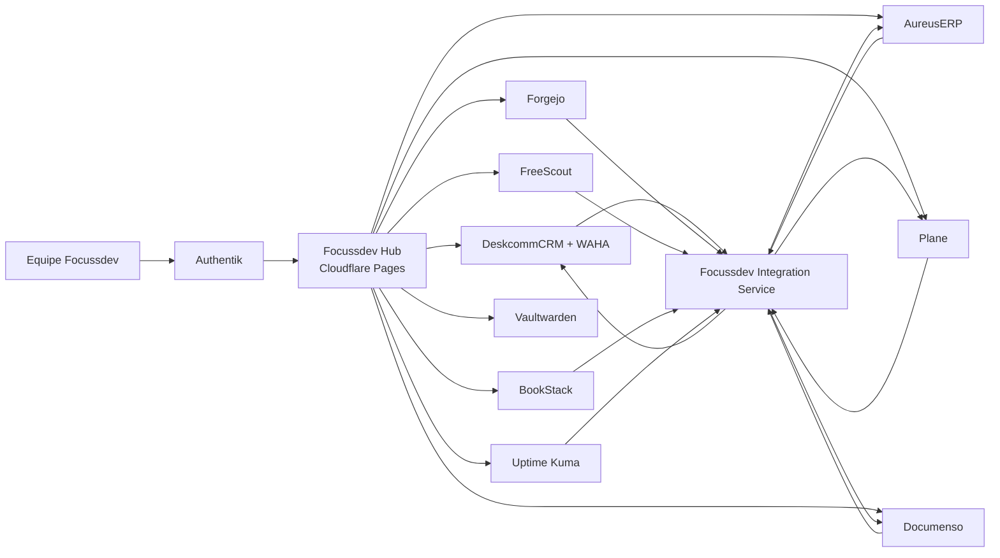

# Arquitetura do ecossistema Focussdev

O Hub é o shell visual único. Ele nunca substitui os dashboards das aplicações. O menu permanece
fixo e a área central carrega o frontend upstream completo quando isso é oficialmente compatível e
seguro; caso contrário, usa o domínio independente sem modificar o código original. Authentik
fornece SSO somente onde o protocolo oficial da aplicação for compatível.

## Regras do mapa

- Entrada: usuário autenticado acessa `app.focussdev.space`.
- Saída: cada módulo disponível abre a aplicação original na área central quando tecnicamente
  seguro; a URL independente permanece como rota de contingência.
- Módulo não concluído: visível como `Em implantação`, sem link enganoso.
- Operação: mudanças em `hub/` na `main` publicam automaticamente no Cloudflare Pages.
- Segredos: Cloudflare API Token existe somente no cofre local criptografado e no GitHub Actions
  Secrets; nunca no Git.
- Dados: cada aplicação conserva banco, volumes, migrations e dashboard originais; integrações
  usam APIs, webhooks e identificadores externos, nunca escrita direta no banco de outra aplicação.
- WhatsApp: o DeskcommCRM usa WAHA. A Evolution API existente na VPS pertence a outro projeto e
  permanece isolada.
- Integrações: o `Focussdev Integration Service` recebe webhooks, persiste eventos antes do
  processamento, aplica idempotência, retries com backoff e dead-letter, e expõe estado e logs em
  `Configurações → Integrações`. O ecossistema não depende de n8n.
