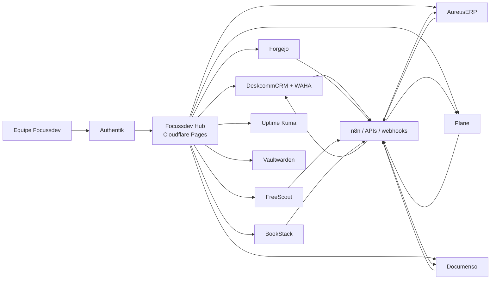

# Arquitetura do ecossistema Focussdev

O Hub é somente a porta de entrada. Ele nunca substitui os dashboards das aplicações. Os links
ativos levam ao frontend upstream completo em subdomínios independentes; Authentik fornece SSO
somente onde o protocolo oficial da aplicação for compatível.

## Regras do mapa

- Entrada: usuário autenticado acessa `app.focussdev.space`.
- Saída: cada módulo disponível abre o domínio da aplicação original.
- Módulo não concluído: visível como `Em implantação`, sem link enganoso.
- Operação: mudanças em `hub/` na `main` publicam automaticamente no Cloudflare Pages.
- Segredos: Cloudflare API Token existe somente no cofre local criptografado e no GitHub Actions
  Secrets; nunca no Git.
- Dados: cada aplicação conserva banco, volumes, migrations e dashboard originais; integrações
  usam APIs, webhooks e identificadores externos, nunca escrita direta no banco de outra aplicação.
- WhatsApp: o DeskcommCRM usa WAHA. A Evolution API existente na VPS pertence a outro projeto e
  permanece isolada.
